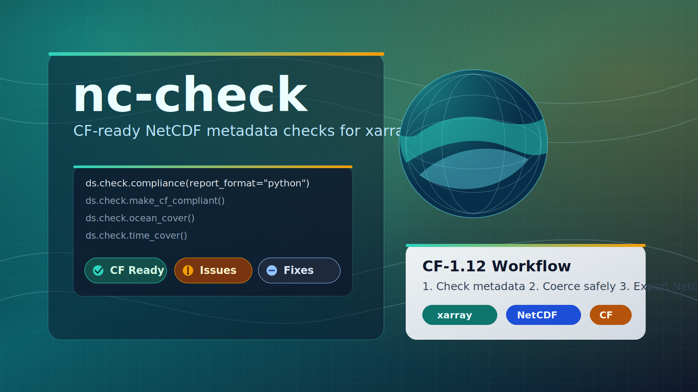

# nc-check



Prepare `xarray.Dataset` objects for CF-1.12-ready NetCDF output.

## What It Does

- Validates metadata and conventions with `ds.check.compliance()`.
- Applies safe non-destructive metadata fixes with `ds.check.make_cf_compliant()`.
- Runs ocean-grid and time-slice coverage checks with `ds.check.ocean_cover()` and `ds.check.time_cover()`.
- Provides both Python and CLI workflows (`nc-check`, `nc-comply`).

## Install

```bash
uv add nc-check
# or
pip install nc-check
```

Optional full CF checker support:

```bash
uv add "nc-check[cf]"
# or
pip install "nc-check[cf]"
```

## Quickstart

```python
import xarray as xr
import nc_check  # Registers ds.check accessor

ds = xr.Dataset(
    data_vars={"temp": (("time", "lat", "lon"), [[[280.0]]])},
    coords={"time": [0], "lat": [10.0], "lon": [20.0]},
)

compliance = ds.check.compliance(report_format="python")
fixed = ds.check.make_cf_compliant()
ocean = ds.check.ocean_cover(report_format="python")
time = ds.check.time_cover(report_format="python")
full = ds.check.all(report_format="python")
```

CLI quickstart:

```bash
nc-check input.nc
nc-check all input.nc --save-report
nc-comply input.nc output.nc
```

## Docs

- [Documentation index](docs/README.md)
- [Getting started](docs/getting-started.md)
- [CLI guide](docs/cli.md)
- [Python API guide](docs/python-api.md)
- [Checks and reports](docs/checks-and-reports.md)
- [Troubleshooting](docs/troubleshooting.md)
- [Development](docs/development.md)
